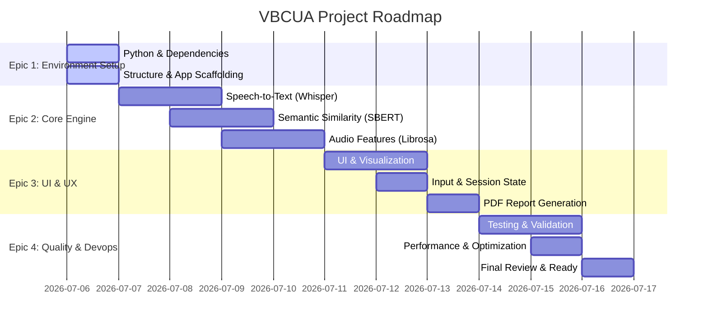

# VBCUA Development Workflow

This document outlines the detailed development workflow, phases, and task breakdowns for the **Voice-Based Concept Understanding Analyser (VBCUA)** application. It defines the roadmap for building a fully operational, high-performance, and visually stunning AI-powered speech analysis app.

---

## 📅 Roadmap Overview

---

## 🛠️ Detailed Epic & Story Breakdown

### Epic 1: Environment Setup
Setting up the environment and creating the skeletal structure to establish a robust foundation for development.

*   **Story 1: Python Environment and Dependency Installation**
    *   Initialize python virtual environment.
    *   Create `requirements.txt` containing all core packages (`streamlit`, `openai-whisper`, `sentence-transformers`, `librosa`, `soundfile`, `fpdf2`, etc.).
    *   Configure dependencies for CPU-friendly execution of AI models.
*   **Story 2: Project Structure Initialization**
    *   Establish folder layout:
        *   `core/`: Core modules for transcription, similarity, and acoustics.
        *   `ui/`: Custom interface components and reports.
        *   `utils/`: PDF rendering and shared helpers.
        *   `tests/`: Unit and validation test files.
        *   `data/`: Directory for holding temporary audio recordings and reference content.
    *   Create standard `__init__.py` files to define packages.
*   **Story 3: Streamlit Application Initialization**
    *   Create the main entry point `app.py`.
    *   Define page configuration, responsive sidebar, navigation menu (Dashboard, Reports, Configuration).
    *   Incorporate premium styling (dark-mode focus, glassmorphism CSS styling cards, clean typography).

---

### Epic 2: Core Engine Development
Implementing the algorithmic engines powering the speech-to-text, semantic scoring, and audio characteristics analyzer.

*   **Story 1: Speech-to-Text Module Development (`core/speech_to_text.py`)**
    *   Integrate `openai-whisper` for local CPU/GPU speech-to-text processing.
    *   Implement resource-cached loading (`st.cache_resource`) to load Whisper models (Tiny, Base, Small) dynamically.
    *   Construct audio transcription pipeline that produces plain-text output along with word-level/segment timestamps.
*   **Story 2: Semantic Understanding and Similarity Engine Development (`core/semantic_analysis.py`)**
    *   Integrate `sentence-transformers` models (e.g., `all-MiniLM-L6-v2`) for generating sentence embeddings.
    *   Implement cosine similarity comparison between the *User Transcription* and the *Reference Concept*.
    *   Implement a normalization score mapping the similarity output $[-1, 1]$ to a client-friendly percentage $[0\%, 100\%]$.
*   **Story 3: Audio Feature Extraction and Scoring Engine Development (`core/audio_features.py`)**
    *   Read audio waveforms using `librosa` and extract sampling rates.
    *   Analyze RMS energy levels to establish speech volume profiling and detect audio drops.
    *   Calculate speech tempo, pause durations (silence thresholds), and compute the pause-to-speech ratio.
    *   Heuristically analyze pauses and pitch variants to detect candidate filler words (e.g., "uh", "um", "ah", and long awkward pauses).
    *   Compute an aggregated Fluency Score.

---

### Epic 3: UI Development
Designing a high-fidelity visual experience in Streamlit featuring interactive feedback, charts, and report generation.

*   **Story 1: User Interface Design and Visualization (`ui/components.py`)**
    *   Draw the raw audio waveform and pitch contour using plotly/matplotlib.
    *   Provide progress metrics, color-coded score cards (Good: Green, Needs Work: Red, etc.), and gauge indicators.
    *   Render a side-by-side comparison pane showing the reference text vs. user transcribed text (with semantic mismatches highlighted).
*   **Story 2: Input Handling and Session State Management (`app.py` & `ui/`)**
    *   Build standard drag-and-drop file uploaders supporting `.wav`, `.mp3`, `.ogg`, and `.m4a` files.
    *   Add controls to input or select standard reference concepts (e.g. explaining "REST API", "Database Indexing", or "Polymorphism").
    *   Save transcription outputs, uploaded paths, and analytical calculations inside `st.session_state` to prevent recalculation on UI interactions.
*   **Story 3: Output Rendering and Report Generation (`ui/reports.py` & `utils/pdf_generator.py`)**
    *   Design a visual "Report Dashboard" summarising performance.
    *   Incorporate a dynamic PDF generator using `fpdf2` that allows the user to download a clean, structured physical document containing the transcription, semantic metrics, acoustic results, and general suggestions.

---

### Epic 4: Testing & Deployment
Verifying the accuracy, stability, and speed of the app, and preparing it for deployment.

*   **Story 1: Functional Testing and Validation (`tests/`)**
    *   Create synthetic mock transcriptions and reference inputs to validate cosine similarity scoring.
    *   Develop unit tests using `pytest` to test Whisper integration, audio parsing, and PDF assembly.
*   **Story 2: Performance Testing and Optimization**
    *   Benchmark audio parsing latency with audio tracks of varying length (10s, 30s, 60s, 120s).
    *   Implement lazy model loading so memory is only allocated when transcription or embedding generation is actually run.
*   **Story 3: Deployment Preparation and Final Review**
    *   Prepare Streamlit `.streamlit/config.toml` setup for performance optimization.
    *   Construct clean README documentation for users to set up the system on local machines.
